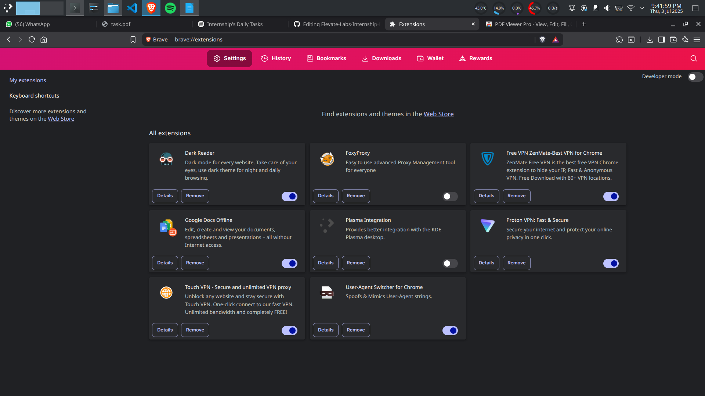
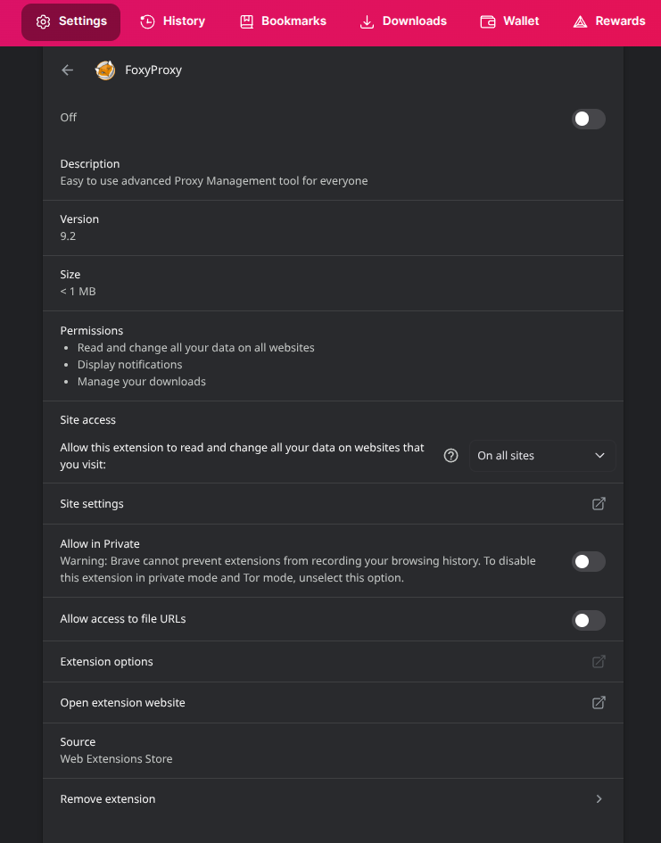

Elevate-Labs-Internship-D07  

Task 07: Identify and Remove Suspicious Browser Extensions  

Objective: Learn to spot and remove potentially harmful browser extensions.  
Tools:Any web browser (Chrome, Firefox)  
Deliverables: List of suspicious extensions found and removed (if any)  

Step 1: Open Extension Manager  
Brave:  
```brave://extensions/ → or go to menu → More Tools → Extensions```  

Step 2: Review Installed Extensions
List out all installed extensions.


Check these:
- Developer name
- User reviews
- Last updated date
- Number of downloads
- Extension permissions (e.g., access to all data, tabs, clipboard)

Step 3: Identify Suspicious/Unused Extensions  
Look for:
- Unknown names or sources
- Overly broad permissions (e.g., “Read and change all your data on all websites”)
- Extensions you didn’t knowingly install
- Negative reviews or flagged by users


Step 4: Remove Suspicious Extensions  
Click Remove or Disable  

Step 5: Restart Browser
Check for:
- Faster loading time
- Reduced memory usage
- No unexpected redirects/popups
